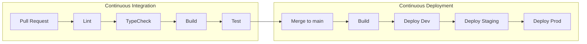

# CI/CD Pipeline Guide

> **EDUCATIONAL TEMPLATE** - This document explains CI/CD concepts for this monorepo.
> All values shown are placeholders for learning purposes.

## Overview

This guide explains how Continuous Integration (CI) and Continuous Deployment (CD) work in this monorepo template. By the end, you'll understand:

- How code changes flow from PR to production
- What each pipeline stage does
- How to set up the required infrastructure
- Common troubleshooting steps

---

## CI/CD Flow Diagram



---

## Environments

| Environment     | Branch  | Purpose                          | URL Pattern               |
| --------------- | ------- | -------------------------------- | ------------------------- |
| **Development** | `dev`   | Latest features, may be unstable | `dev.<YOUR-DOMAIN>.com`   |
| **Staging**     | `stage` | Pre-production testing           | `stage.<YOUR-DOMAIN>.com` |
| **Production**  | `main`  | Live user-facing app             | `<YOUR-DOMAIN>.com`       |

### Environment Strategy

1. **Development**: Auto-deploys on every push to `dev`. Used for internal testing.
2. **Staging**: Auto-deploys on every push to `stage`. Used for QA and stakeholder review.
3. **Production**: Manual deployment from `main` with confirmation required.

---

## Branch Strategy

```
dev (development)
├── feature/add-login      → PR to dev
├── feature/user-dashboard → PR to dev
├── bugfix/fix-nav         → PR to dev
│
stage (staging)            ← Merge from dev
│
main (production)          ← Manual promote from stage
```

### Branch Rules

| Branch  | Protected | CI Required    | Deploy Target |
| ------- | --------- | -------------- | ------------- |
| `dev`   | Yes       | Yes            | Development   |
| `stage` | Yes       | Yes            | Staging       |
| `main`  | Yes       | Yes + Approval | Production    |

---

## Required Secrets

These secrets must be configured in your GitHub repository settings:

| Secret Name                      | Description           | Example Value                                                                                                                 |
| -------------------------------- | --------------------- | ----------------------------------------------------------------------------------------------------------------------------- |
| `GCP_PROJECT_ID`                 | Your GCP project ID   | `<YOUR-GCP-PROJECT-ID>`                                                                                                       |
| `GCP_SA_EMAIL`                   | Service account email | `github-actions-sa@<YOUR-GCP-PROJECT-ID>.iam.gserviceaccount.com`                                                             |
| `GCP_WORKLOAD_IDENTITY_PROVIDER` | WIF provider path     | `projects/<YOUR-GCP-PROJECT-ID>/locations/global/workloadIdentityPools/github-actions-pool/providers/github-actions-provider` |

### Setting Up Secrets

1. Go to your GitHub repository
2. Navigate to **Settings** > **Secrets and variables** > **Actions**
3. Click **New repository secret**
4. Add each secret from the table above

---

## Workload Identity Federation (WIF)

### What is WIF?

Workload Identity Federation allows GitHub Actions to authenticate with GCP **without storing long-lived credentials**. Instead:

1. GitHub generates a short-lived OIDC token
2. GCP validates the token against your Workload Identity Pool
3. If valid, GCP issues temporary credentials
4. The workflow uses these credentials for deployment

### Why Use WIF?

| Traditional Approach                | WIF Approach                 |
| ----------------------------------- | ---------------------------- |
| Store service account key as secret | No stored credentials        |
| Keys can be leaked or stolen        | Tokens expire in minutes     |
| Manual key rotation required        | Automatic credential refresh |
| Hard to audit usage                 | Full audit trail in GCP      |

### How It Works

```
GitHub Actions                      GCP
     │                               │
     │  1. Request OIDC token        │
     │──────────────────────────────>│
     │                               │
     │  2. Validate token against    │
     │     Workload Identity Pool    │
     │<──────────────────────────────│
     │                               │
     │  3. Issue temporary creds     │
     │     for service account       │
     │<──────────────────────────────│
     │                               │
     │  4. Use creds for deployment  │
     │──────────────────────────────>│
```

---

## Version Requirements

Ensure your environment meets these minimum versions:

| Tool         | Minimum Version | Check Command        |
| ------------ | --------------- | -------------------- |
| Node.js      | 20.x            | `node --version`     |
| pnpm         | 8.x             | `pnpm --version`     |
| Firebase CLI | 13.x            | `firebase --version` |
| gcloud CLI   | Latest          | `gcloud --version`   |

### Installing Tools

```bash
# Node.js (via nvm)
nvm install 20
nvm use 20

# pnpm
npm install -g pnpm@8

# Firebase CLI
npm install -g firebase-tools@latest

# gcloud CLI - see https://cloud.google.com/sdk/docs/install
```

---

## Pipeline Stages Explained

### Continuous Integration (CI)

| Stage          | Tool             | Purpose                                    |
| -------------- | ---------------- | ------------------------------------------ |
| **Lint**       | ESLint, Prettier | Enforce code style and catch common errors |
| **Type Check** | TypeScript       | Ensure type safety across the codebase     |
| **Build**      | Turborepo        | Compile all packages and apps              |
| **Test**       | Vitest           | Run unit and integration tests             |

### Continuous Deployment (CD)

| Stage                | Tool      | Purpose                             |
| -------------------- | --------- | ----------------------------------- |
| **Build**            | Turborepo | Production build with optimizations |
| **Deploy Hosting**   | Firebase  | Deploy static assets to CDN         |
| **Deploy Functions** | Firebase  | Deploy serverless backend           |

---

## Troubleshooting

### Common Issues

#### "Permission denied" during deployment

**Cause**: Service account missing required permissions.

**Fix**: Ensure the service account has these roles:

- `roles/firebase.admin`
- `roles/cloudfunctions.developer`
- `roles/iam.serviceAccountUser`

#### "Workload Identity Pool not found"

**Cause**: WIF not set up or wrong provider path.

**Fix**:

1. Run `scripts/setup-wif.sh` with correct values
2. Verify the `GCP_WORKLOAD_IDENTITY_PROVIDER` secret matches the output

#### "Build failed: Cannot find module"

**Cause**: Dependencies not installed or cached incorrectly.

**Fix**: Clear cache and reinstall:

```bash
pnpm store prune
rm -rf node_modules
pnpm install
```

#### "Turborepo cache miss on every run"

**Cause**: Inputs/outputs not configured correctly in `turbo.json`.

**Fix**: Review `turbo.json` and ensure task configurations match your file structure.

---

## Setup Checklist

Use this checklist when setting up CI/CD for a new environment:

- [ ] GCP project created with billing enabled
- [ ] Run `scripts/setup-wif.sh` with real values
- [ ] Add secrets to GitHub repository
- [ ] Copy workflow files to `.github/workflows/`
- [ ] Replace all `<YOUR-VALUE-HERE>` placeholders
- [ ] Test with a PR to verify CI runs
- [ ] Merge to main to verify CD runs
- [ ] Verify deployment at target URL

---

## Documentation

### Workflow Documentation

| Document                           | Purpose                         |
| ---------------------------------- | ------------------------------- |
| [CI.md](CI.md)                     | Continuous Integration workflow |
| [Deploy-Dev.md](Deploy-Dev.md)     | Development deployment          |
| [Deploy-Stage.md](Deploy-Stage.md) | Staging deployment              |
| [Deploy-Main.md](Deploy-Main.md)   | Production deployment           |

### Recommended Reading Order

1. **This guide** - You are here! Concepts and overview
2. [CI.md](CI.md) - Understand the CI workflow
3. [Deploy-Dev.md](Deploy-Dev.md) - Development deployment details
4. [Deploy-Stage.md](Deploy-Stage.md) - Staging deployment details
5. [Deploy-Main.md](Deploy-Main.md) - Production deployment (with safety measures)
6. [setup-wif.sh](../../scripts/setup-wif.sh) - WIF infrastructure setup

---

## Summary

This boilerplate includes a **fully configured CI/CD pipeline**:

- ✅ **CI workflow** - Lint, typecheck, build, test on every PR
- ✅ **Dev deployment** - Auto-deploy on push to `dev`
- ✅ **Stage deployment** - Auto-deploy on push to `stage`
- ✅ **Production deployment** - Manual with confirmation
- ✅ **WIF authentication** - Secure, keyless GCP access
- ✅ **GitHub environments** - `dev`, `stage`, `main`

To enable deployments, configure your GitHub secrets with WIF credentials from `scripts/setup-wif.sh`.
